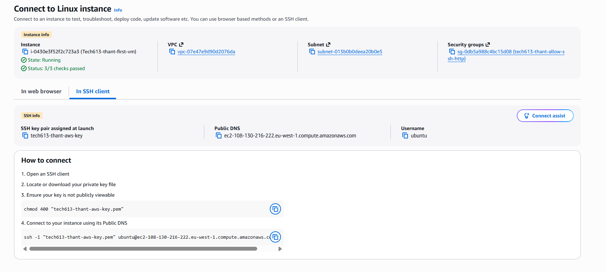
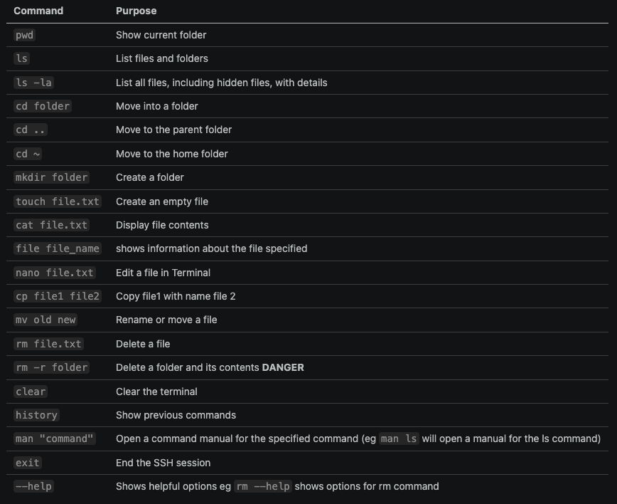

# AWS Virtual Machine & Linux Notes

## AWS Basics

**Choose region first:** EU (Ireland)

**Security Group = Firewall**


---

## How to Connect to the Virtual Machine

**Step 1:** Open Git Bash

**Step 2:** Go to the `.ssh` folder

```bash
cd .ssh
```

**Step 3:** Copy and paste the public DNS from *SSH Client* through *Instance Connect*


**Step 4:** Type `yes` and the VM is ready to go

> **Important Note:** Every time we stop and start the instance again, the public IP will change.

---


### Why Learn Linux?

- Can be lightweight
- Fast-growing, commonly used
- Most distributions are free
- Stable
- Scales well
- Works on desktop/workstation
- Often used in DevOps

### What is Linux?

- A spinoff of the Unix OS
- Can now run on very small computers
- Made up of a kernel (core OS), plus other libraries and utilities that rely on the kernel

### What is Bash?

- It is a shell
- Stands for **B**ourne **A**gain **Sh**ell

### What is a Shell?

- It interprets the commands

### How to Find the Shell We Are Using

```bash
cat /etc/shells
```

---

## Useful Notes & Commands

- `/` at the front refers to the **root directory**
- `cd ~` goes to the home directory (the `~` symbol is called a **tilde**, pronounced *TIL-duh* or *TIL-day*)
- `rm -r` removes files recursively

# Linux Commands (Part - 1)


| Term | Path | What it is |
| --- | --- | --- |
| Root directory | `/` | Top of the whole filesystem |
| Home directory | `/home/yourname` (or `~`) (or cd)| Your personal space |
| Root user's home | `/root` | Home folder of the superuser |


---

# Linux Commands (Part - 2)
- **sudo apt-get update** (update)
- **sudo apt upgrade -y** (upgrade and say "yes" to every ques)
- **sudo apt-get install tree** (install the tree command, which shows files and folders directory)
- **head/tail -2 chickenjoke.txt** (check first or last two lines)
- **nl chickenjoke.txt** (number the lines)
- **cat chickenjoke.txt | grep chicken** (to find the specific word)
- **sudo su** (superuser switches to root)

sudo  = super user <br>
grep = to search the line with specific word <br>
control + C = to cancel the command <br>
su = switch

### Important Notes
- **mv** can either rename or move to another folder <br>
 (for example: mv chickenjoke.txt badjoke.txt = rename, <br>
 mv chickenjoke.txt ~ = move to home folder)

---

# Linux Command (Part-3)

First two commands to run before starting installing any things

- sudo apt-get update
- sudo apt-get upgrade


---

- **./** to run the file in the current dir
- **printenv** (displays environment variables and their values.)
- **echo $variable_name** (print command)
- **export variablename=value**(to set environment variable)
- **printenv variablename**(display environment variables)
- **$** (put infront of vairablename when use)
- source .bashrc (reload file)

### Note:
- A variable stores value and memory 
- An environment variable is a named value that your terminal makes available to programs it starts.

### Manage Processor

What is a processor?
- A processor, usually called the CPU (Central Processing Unit), is the part of a computer that runs instructions and performs calculations.

- ps (check processor)
- ps --help s 
- ps aux (shows alll  running processes on linux system)
- top (show a live view of processes and resource usage)
- pgrep nginx (find the PIDS of Nginx processes)
- sleep mins (pause a specific amount of time) 
- kill PID  (requests that a process stop)
- jobs (show tasks that are running in the background or in pasued)

**Common Types of KILL**
| Command | Signal | Purpose |
|---|---|---|
| `kill PID` or `kill -15 PID` | **SIGTERM** | Asks the process to exit gracefully, allowing cleanup |
| `kill -9 PID` | **SIGKILL** | Forces it to end immediately, without cleanup |
| `kill -STOP PID` | **SIGSTOP** | Pauses the process |
| `kill -CONT PID` | **SIGCONT** | Resumes a paused process |

| Term | Meaning |
|---|---|
| **Parent process** | A process that creates another process |
| **Child process** | The process created by the parent |
| **Zombie process** | A child that has finished, but whose parent hasn’t collected its exit status yet |

